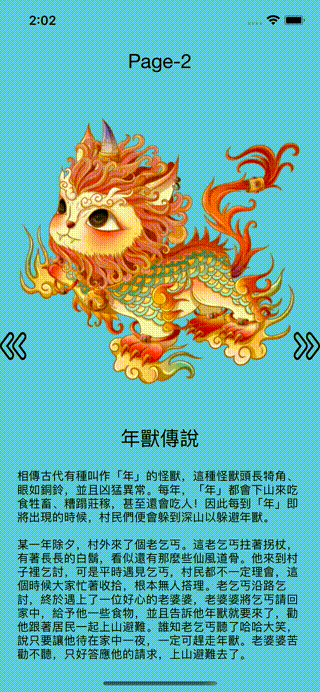
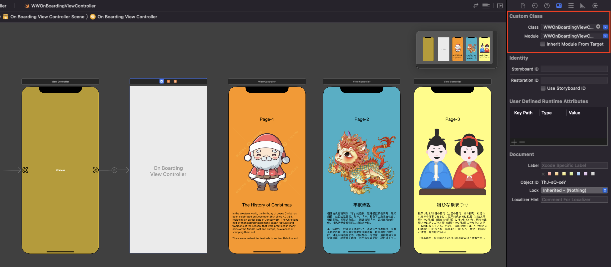

# WWOnBoardingViewController

[](https://developer.apple.com/swift/) [](https://developer.apple.com/swift/)  [](https://developer.apple.com/swift/) [](https://developer.apple.com/swift/)

## [Introduction - 簡介](https://swiftpackageindex.com/William-Weng)

Use UIPageViewController to simply implement the function of the guide page.

使用UIPageViewController來簡單實現引導頁面的功能。

## [Achievements display - 成果展示](https://www.hkweb.com.hk/blog/ui設計基礎知識：引導頁對ui設計到底有什麼作用/)
  

## [Installation with Swift Package Manager - 安裝方式](https://medium.com/彼得潘的-swift-ios-app-開發問題解答集/使用-spm-安裝第三方套件-xcode-11-新功能-2c4ffcf85b4b)

```bash
dependencies: [
    .package(url: "https://github.com/William-Weng/WWOnBoardingViewController.git", .upToNextMajor(from: "1.0.0"))
]
```

## Usage - 使用方式

Set UIPageViewController to WWOnBoardingViewController.

將UIPageViewController設定成WWOnBoardingViewController。



## Function - 可用函式

|函式|功能|
|-|-|
|previousPage(animated:completion:)|回上一頁|
|nextPage(animated:completion:)|到下一頁|
|rootPage(animated:completion:)|回到首頁|
|lastPage(animated:completion:)|到最後一頁|
|moveNextPage(to:for:animated:completion:)|到某一頁|

## WWOnBoardingViewControllerDelegate

|函式|功能|
|-|-|
|viewControllers(onBoardingViewController:) -> [UIViewController]|換頁的UIViewControllers|
|willChangeViewController(_:currentIndex:nextIndex:error: WWOnBoardingViewController.OnBoardingError?)|將要換頁功能|
|didChangeViewController(_:finishAnimating:transitionCompleted:currentIndex:nextIndex:error: WWOnBoardingViewController.OnBoardingError?)|換頁完成功能|

## Example - 程式範例
```swift
import UIKit
import WWPrint
import WWOnBoardingViewController

// MARK: - ViewController
final class ViewController: UIViewController {

    @IBOutlet weak var pageControl: UIPageControl!
    
    private lazy var pageViewControllerArray: [UIViewController] = {
        return [
            pageViewController(with: "Page1"),
            pageViewController(with: "Page2"),
            pageViewController(with: "Page3"),
        ]
    }()
    
    private let currentPage = 0
    private var onBoardingViewController: WWOnBoardingViewController?

    override func viewDidLoad() {
        super.viewDidLoad()
        pageContolSetting()
    }
    
    override func prepare(for segue: UIStoryboardSegue, sender: Any?) { initSetting(for: segue, sender: sender) }
    
    @IBAction func previousPage(_ sender: UIButton) { onBoardingViewController?.previousPage(completion: nil) }
    @IBAction func nextPage(_ sender: UIButton) { onBoardingViewController?.nextPage(completion: nil) }
    @IBAction func rootPage(_ sender: UIButton) { onBoardingViewController?.rootPage(completion: nil) }
    @IBAction func lastPage(_ sender: UIButton) { onBoardingViewController?.lastPage(completion: nil) }
    
    @objc func changeCurrentPage(_ sender: UIPageControl) {
        onBoardingViewController?.moveNextPage(to: sender.currentPage, for: .forward, animated: true, completion: nil)
    }
}

// MARK: - WWOnBoardingViewControllerDelegate
extension ViewController: WWOnBoardingViewControllerDelegate {
    
    func viewControllers(onBoardingViewController: WWOnBoardingViewController) -> [UIViewController] {
        return pageViewControllerArray
    }
    
    func changeViewController(_ onBoardingViewController: WWOnBoardingViewController, didFinishAnimating finished: Bool, currentIndex: Int, nextIndex: Int, error: WWOnBoardingViewController.OnBoardingError?) {
        pageControl.currentPage = currentIndex
    }
}

// MARK: - 小工具
private extension ViewController {
    
    /// 找到WWOnBoardingViewController
    /// - Parameters:
    ///   - segue: UIStoryboardSegue
    ///   - sender: Any?
    func initSetting(for segue: UIStoryboardSegue, sender: Any?) {
        
        onBoardingViewController = segue.destination as? WWOnBoardingViewController
        onBoardingViewController?.setting(onBoardingDelegate: self, isInfinityLoop: true, currentIndex: currentPage)
    }
    
    /// 尋找Storyboard上的ViewController for StoryboardId
    /// - Parameter indentifier: String
    /// - Returns: UIViewController
    func pageViewController(with indentifier: String) -> UIViewController {
        return UIStoryboard(name: "Main", bundle: nil).instantiateViewController(withIdentifier: indentifier)
    }
    
    /// [PageControl設定](https://medium.com/彼得潘的-swift-ios-app-開發問題解答集/ios-14-進化的-page-control-f097af2801a6)
    func pageContolSetting() {

        pageControl.allowsContinuousInteraction = true
        pageControl.numberOfPages = pageViewControllerArray.count
        pageControl.currentPage = currentPage
        pageControl.backgroundStyle = .prominent
        
        // pageControl.preferredIndicatorImage = UIImage(systemName: "sun.max.fill")
        (0..<pageControl.numberOfPages).forEach { pageControl.setIndicatorImage(UIImage(systemName: "\($0).circle"), forPage: $0) }
        pageControl.addTarget(self, action: #selector(changeCurrentPage(_:)), for: .valueChanged)
    }
}
```

